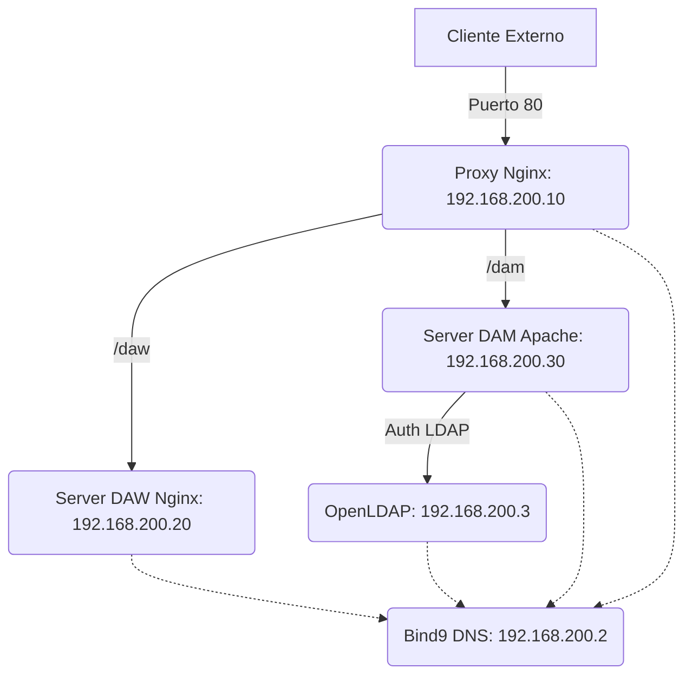

# Proyecto de Infraestructura: dns-mas-cosas

Este proyecto despliega una infraestructura de red orquestada por Docker que incluye servicios de DNS, LDAP, Proxy Inverso y servidores web (Apache y Nginx). Está diseñado para simular un entorno educativo o empresarial bajo el dominio `iesluisvives.org`.

## Estructura del Proyecto

```text
📂 dns-mas-cosas
├── 📄 docker-compose.yml
├── 📄 README.md
├── 📂 backend-dam/
│   ├── 📄 index.html
│   └── 📂 calificaciones/
│       ├── 📄 .htaccess
│       └── 📄 index.html
├── 📂 backend-daw/
│   ├── 📄 index.html
│   └── 📂 calificaciones/
│       └── 📄 index.html
├── 📂 dns/
│   ├── 📄 db.192.168.200
│   ├── 📄 db.iesluisvives.org
│   └── 📄 named.conf.local
├── 📂 ldap/
│   └── 📄 users.ldif
└── 📂 nginx-proxy/
    ├── 📄 .htpasswd
    └── 📄 default.conf
```

> **Nota**: Los iconos 📂 representan carpetas y 📄 representan archivos de configuración o contenido.

## Arquitecura de Red

El proyecto utiliza una red interna bridge llamada `vives-net` con la subred `192.168.200.0/24`.



## Servicios Comprendidos

### 1. DNS Server (`dns-server`)
- **Imagen**: `ubuntu/bind9:latest`
- **IP**: `192.168.200.2`
- **Función**: Servidor DNS autoritativo para `iesluisvives.org`. Gestiona la resolución directa e inversa.
- **Configuración**: Localizada en [dns/](file:///c:/Users/Aragorn/Desktop/dns-mas-cosas/dns/).

### 2. Directorio LDAP (`ldap-server`)
- **Imagen**: `osixia/openldap:1.5.0`
- **IP**: `192.168.200.3`
- **Dominio**: `iesluisvives.org`
- **Función**: Proporciona servicios de autenticación centralizada para el backend DAM.

### 3. Backend DAW (`server_daw`)
- **Imagen**: `nginx:alpine`
- **IP**: `192.168.200.20`
- **Contenido**: [backend-daw/](file:///c:/Users/Aragorn/Desktop/dns-mas-cosas/backend-daw/).

### 4. Backend DAM (`server_dam`)
- **Imagen**: `httpd:2.4` (Apache)
- **IP**: `192.168.200.30`
- **Contenido**: [backend-dam/](file:///c:/Users/Aragorn/Desktop/dns-mas-cosas/backend-dam/).
- **Seguridad**: Utiliza un archivo `.htaccess` para autenticar a los alumnos contra el servidor LDAP en la ruta `/calificaciones`.

### 5. Proxy Inverso (`proxy_main`)
- **Imagen**: `bitnami/nginx:latest`
- **IP**: `192.168.200.10`
- **Puertos**: Mapea el tráfico del puerto `80` (host) al `8080` (contenedor).
- **Rutas**:
    - `/daw`: Redirige al servidor DAW.
    - `/dam`: Redirige al servidor DAM.
- **Seguridad**: Implementa `auth_basic` en las rutas `/daw/calificaciones/` y `/dam/calificaciones/` usando un archivo `.htpasswd`.

## Instrucciones de Despliegue

Para levantar toda la infraestructura, ejecuta:

```powershell
docker-compose up -d
```

## Seguridad y Acceso

- **Zonas Restringidas**: Tanto en DAW como en DAM, el acceso a las calificaciones está protegido.
- **Credenciales**:
    - LDAP Admin Password: `admin` (Configurado en `docker-compose.yml`).
    - Nginx Auth: Configurado en [nginx-proxy/.htpasswd](file:///c:/Users/Aragorn/Desktop/dns-mas-cosas/nginx-proxy/.htpasswd).

## 👤 Autor

<div align="center">
  
  <br>
  <h3><a href="https://github.com/Aragorn7372">Aragorn</a></h3>
  <p>Creador de la Infraestructura <code>iesluisvives.org</code></p>
</div>

